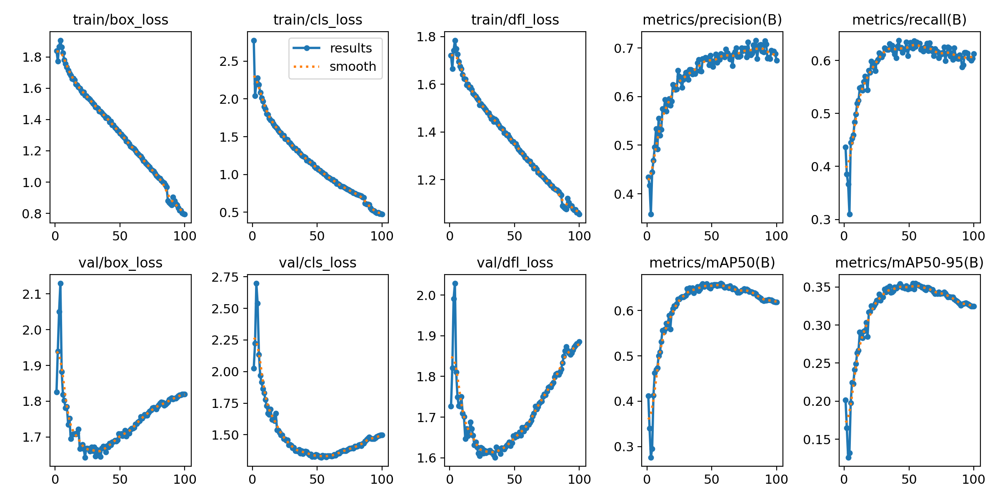
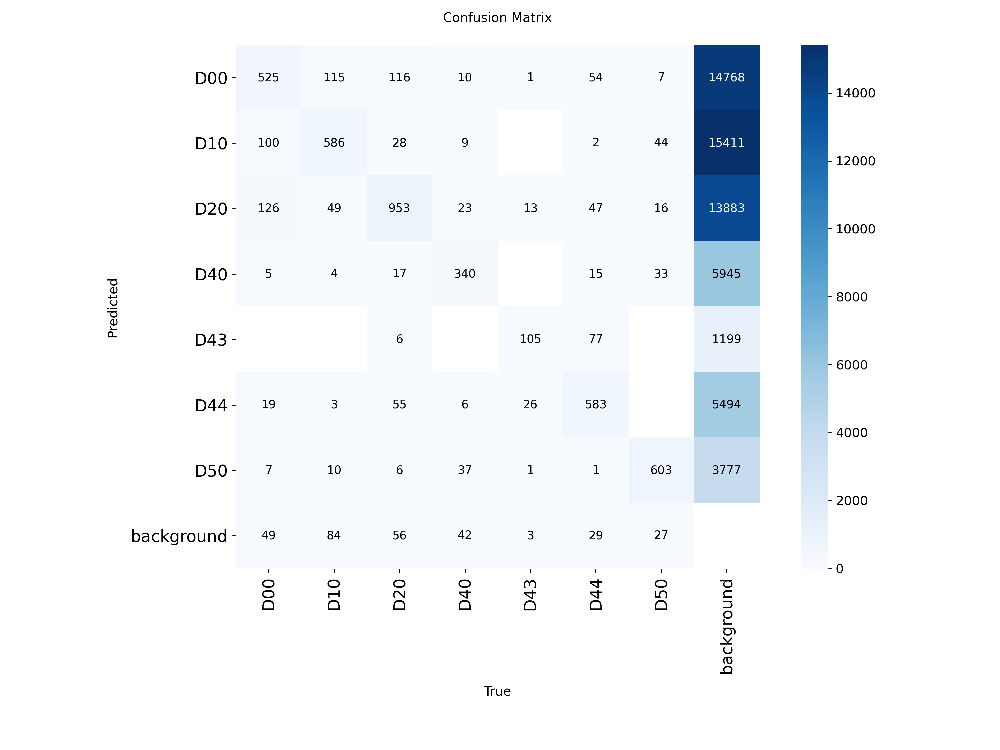
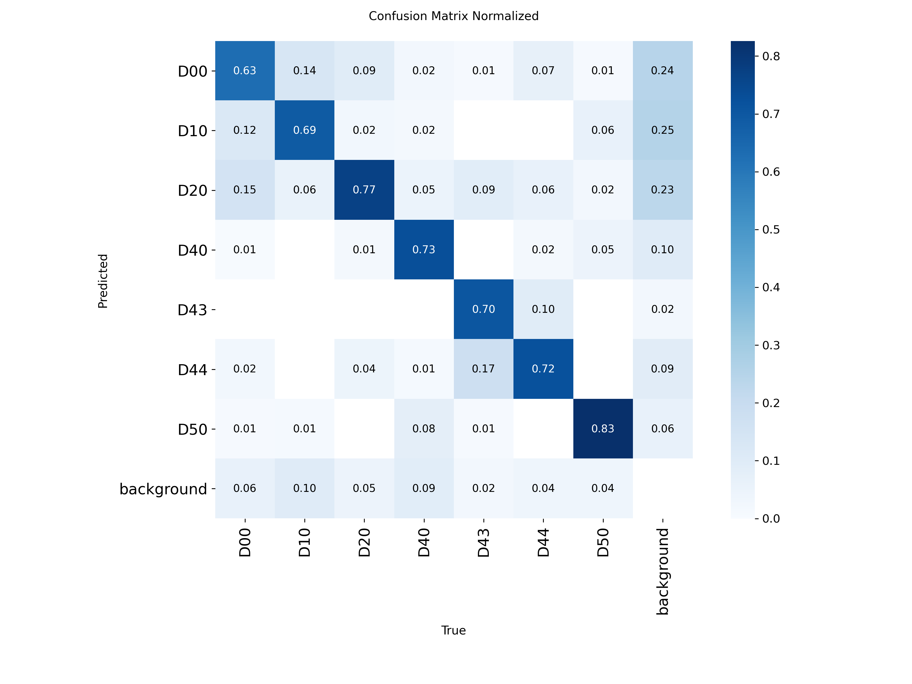
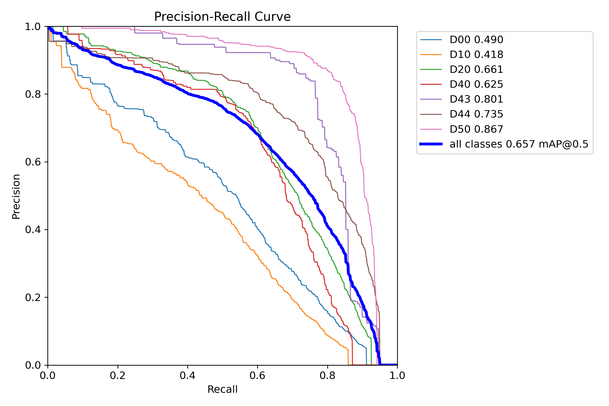
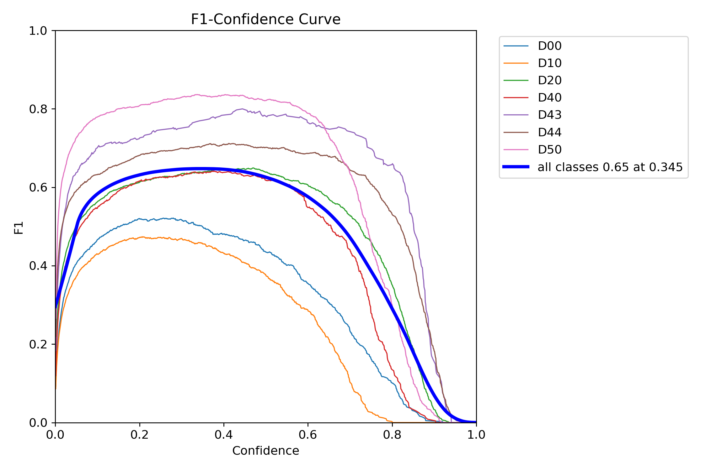
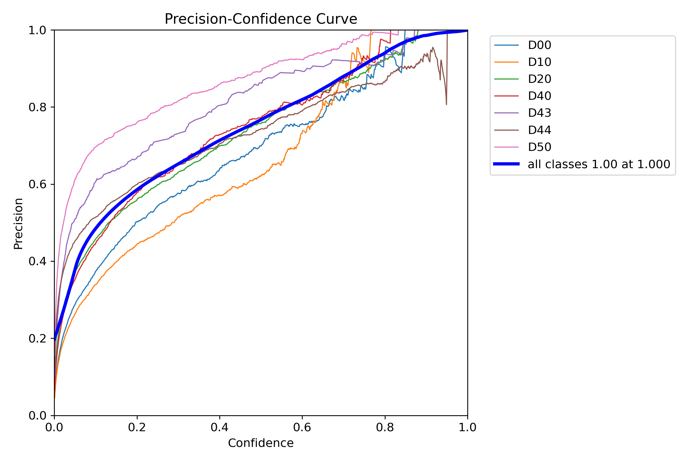
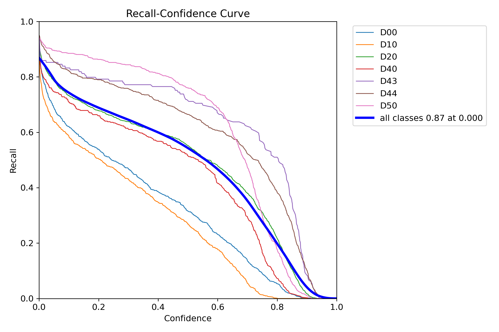
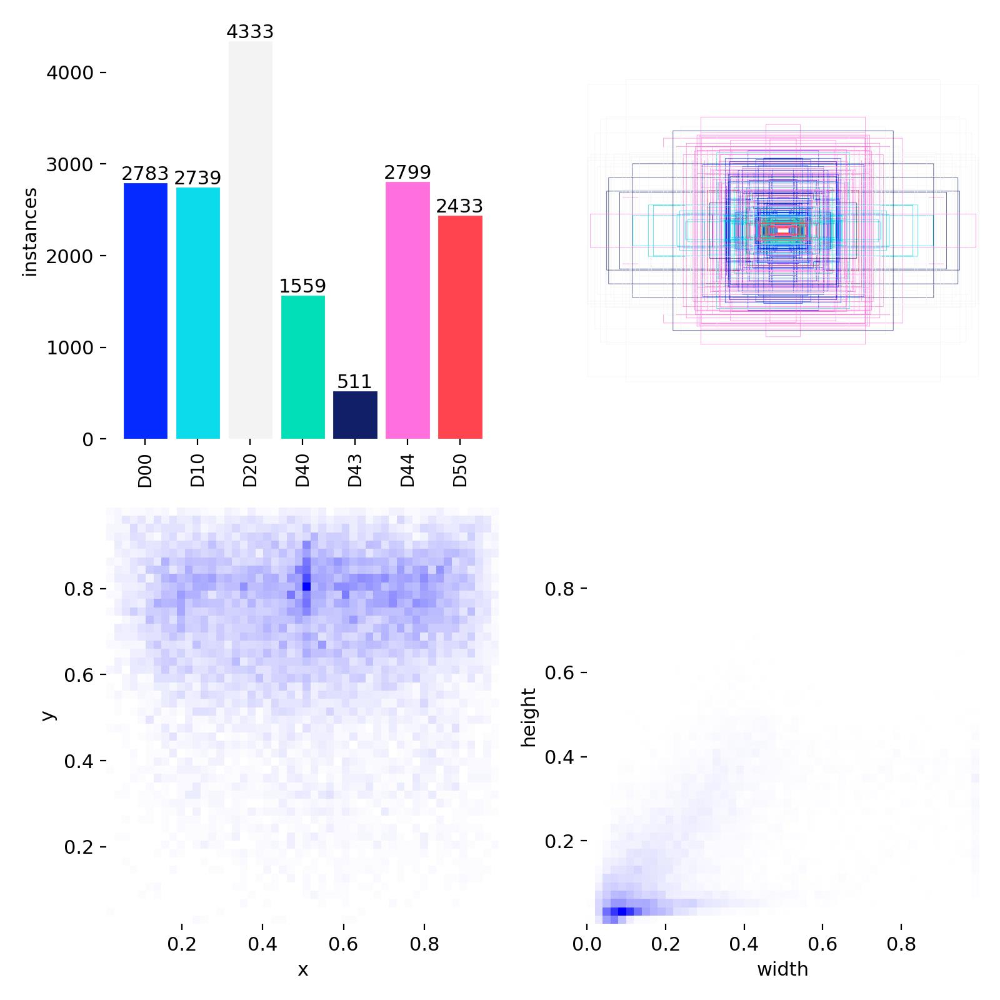

# 🛣️ RoadDamageAI

An AI-powered desktop application for automatic road damage detection using **YOLOv8**, **Python**, **OpenCV**, and **CustomTkinter**.

RoadDamageAI allows users to analyze road images, detect various types of road damage, visualize the results with bounding boxes and confidence scores, and save the annotated output.

---

## 📸 Features

- 🧠 AI-powered road damage detection using YOLOv8
- 🖥️ Modern desktop GUI built with CustomTkinter
- 📂 Open road images from your computer
- 🚀 One-click road damage detection
- 📊 Confidence score for each detected damage
- 🖼️ Side-by-side original and detected image preview
- 💾 Save annotated detection results
- 🌙 Modern dark-themed interface

---

## 🛣️ Supported Damage Types

The trained model can detect the following road conditions:

| Class ID | Damage Type |
|----------|----------------------|
| D00 | Longitudinal Crack |
| D10 | Transverse Crack |
| D20 | Alligator Crack |
| D40 | Pothole |
| D43 | Crosswalk Blur |
| D44 | White Line Blur |
| D50 | Utility Hole |

---

## 📂 Project Structure

```text
RoadDamageAI/
│
├── app.py                 # Desktop GUI
├── train.py               # Model training
├── predict.py             # Prediction script
├── requirements.txt
├── README.md
├── .gitignore
│
├── models/
│   └── best.pt            # Trained YOLOv8 model
│
├── test_images/           # Sample images
│
└── output/                # Saved detection results
```

---

## 🧠 Technologies Used

- Python 3.14
- Ultralytics YOLOv8
- OpenCV
- CustomTkinter
- Pillow
- NumPy

---

## ⚙️ Installation

Clone the repository

```bash
git clone https://github.com/shuarya-anand/RoadDamageAI.git
cd RoadDamageAI
```

Create a virtual environment

### Linux / macOS

```bash
python -m venv .venv
source .venv/bin/activate
```

### Windows

```powershell
python -m venv .venv
.venv\Scripts\activate
```

Install the required packages

```bash
pip install -r requirements.txt
```

---

## ▶️ Running the Application

Start the desktop application

```bash
python app.py
```

---

## 📖 How to Use

1. Launch the application.
2. Click **📂 Open Image**.
3. Select a road image.
4. Click **🚀 Run Detection**.
5. View the detected road damages.
6. Save the annotated result using **💾 Save Image**.

---

## 📊 Example Workflow

```text
Road Image
     │
     ▼
YOLOv8 Model
     │
     ▼
Road Damage Detection
     │
     ▼
Bounding Boxes + Confidence
     │
     ▼
Annotated Image
```

---

## 📦 Model

The repository includes the trained YOLOv8 model:

```
models/best.pt
```

This allows the application to run immediately without retraining.

---

## 📚 Dataset

This project was trained using the **RDD2022 (Road Damage Detection 2022)** dataset.

The dataset is **not included** in this repository because it is publicly available.

You can download it from:

- https://github.com/sekilab/RoadDamageDetector
- https://datasetninja.com/road-damage-detection

After downloading, place the dataset inside a folder named:

```text
dataset/
```


## 📈 Overall Training Results



---

## 📊 Confusion Matrix



---

## 📊 Normalized Confusion Matrix



---

## 📉 Precision-Recall Curve



---

## 📈 F1 Score Curve



---

## 📈 Precision Curve



---

## 📈 Recall Curve



---

## 🏷️ Dataset Labels



## 📈 Future Improvements

- 🎥 Video road damage detection
- 📷 Live webcam detection
- 📄 PDF inspection report generation
- 🌍 GPS location integration
- 📊 Detection statistics dashboard
- ☁️ Cloud deployment
- 📱 Mobile application

---

## 👨‍💻 Author

**Shaurya Anand**

RoadDamageAI was developed as a school AI project demonstrating the application of deep learning and computer vision for automated road damage detection.

---

## 📜 License

This project is released under the **MIT License**.

You are free to use, modify, and distribute this project for educational and personal purposes.

---

## ⭐ Support

If you found this project useful, consider giving it a ⭐ on GitHub.
